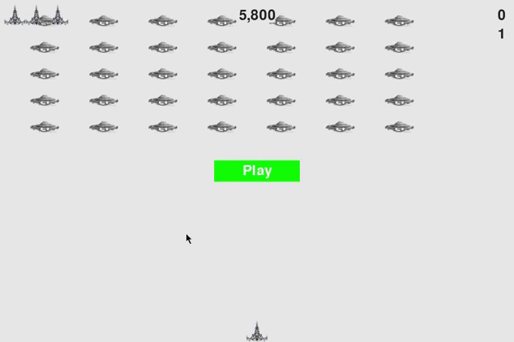

Использованные библиотеки:

  
***
Проект из книги Python Crash Course. Основная тема этого проекта - **Объектно-Ориентированное Программирование.**
 

- Цель: убивать пришельцев до того, как они столкнутся с вами или достигнут края экрана
- Каждый пришелец изначально стоит `50` очков, затем с каждым уровнем его стоимость увеличивается на `50%`
- Когда игрок уничтожает весь флот пришельцев на экране, то появляется следующий
- Скорость движения увеличивается на `10%` с каждым уровнем
- Игра сохраняет рекорд набранных очков в `.txt` файле
